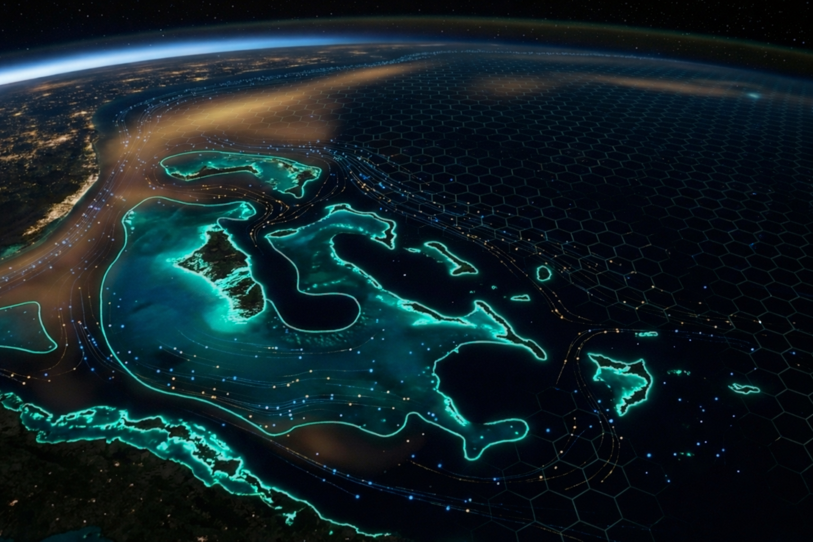
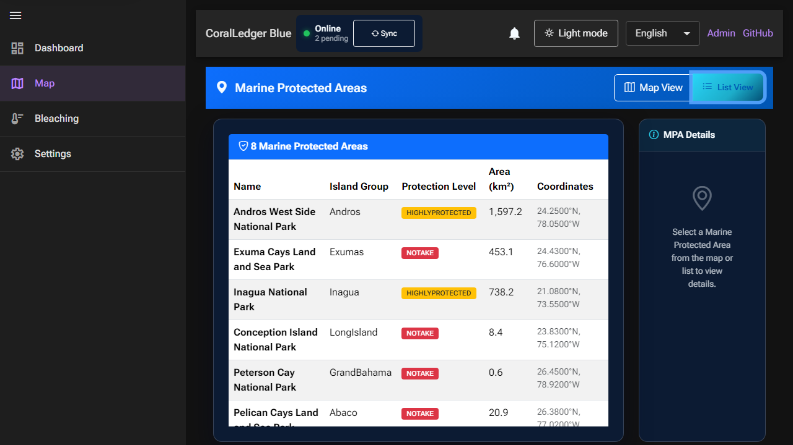

# CoralLedger Blue



**Open Source Marine Intelligence for the Blue Economy**

[](https://dotnet.microsoft.com/)
[](https://blazor.net/)
[](https://postgis.net/)
[](LICENSE)
[](https://github.com/caribdigital/coralledgerblue)

> **Real-time coral bleaching monitoring. Fishing vessel tracking. Multi-tenant regional deployments. One command to run.**

CoralLedger Blue connects NOAA satellite data and Global Fishing Watch to help protect the Bahamas' 2,854 km² of ocean reserves—and can be deployed across the entire Caribbean.

Built with .NET 10, Blazor, PostGIS, and .NET Aspire—because saving reefs should be as easy as `dotnet run`.

## Quick Start

```bash
# Clone and run (requires .NET 10 SDK + Docker)
git clone https://github.com/caribdigital/coralledgerblue.git
cd coralledgerblue
dotnet run --project src/CoralLedger.Blue.AppHost
```

The Aspire dashboard opens at `https://localhost:17088` with links to the web app, pgAdmin, and PostgreSQL.

## What Can You Do With It?

### Core Features
- **Visualize all 8 Bahamas MPAs** on an interactive map with protection-level styling
- **Monitor coral bleaching risk** with live NOAA satellite data (SST, DHW, alerts)
- **Track fishing vessels** and detect activity inside protected areas
- **Generate PDF reports** for MPA status monitoring and stakeholder briefings
- **Record patrol routes** for conservation officers with GPS tracking and playback

### Platform Capabilities
- **Multi-tenant architecture** - Deploy for multiple nations/regions from a single instance
- **Public REST API** with OAuth2-style API key authentication for integrations
- **Offline map tiles** - Cache map data for field use without internet connectivity
- **Gamification system** - Badges, leaderboards, and tier progression for citizen scientists
- **Multilingual support** - Available in English, Spanish, and Haitian Creole

### Developer Experience
- **Run locally in 30 seconds** with .NET Aspire (PostgreSQL + PostGIS included)
- **Comprehensive API** for your own analysis or integrations
- **797+ automated tests** covering domain, application, infrastructure, and integration layers

## Why This Matters

The Bahamas possesses one of the world's most extensive coral reef systems—and it's under threat.

- **Climate change** is warming the ocean, causing mass coral bleaching events
- **Illegal fishing** depletes protected marine areas
- **Conservation officers** lack real-time data to respond effectively

CoralLedger Blue puts satellite data, vessel tracking, and spatial analysis into the hands of the people protecting these ecosystems. It's not just code—it's a tool for the Blue Economy.

## Help Wanted

We're actively looking for contributors in these areas:

| Area | Difficulty | What You'll Do |
|------|------------|----------------|
| **Testing** | Medium | Help build comprehensive test coverage |
| **Translations** | Easy | Improve Spanish/Haitian Creole translations |
| **GIS Optimization** | Advanced | Improve PostGIS query performance |
| **Documentation** | Easy | Expand guides and tutorials |
| **Mobile UX** | Medium | Improve responsive design for tablets |

[See all Good First Issues](https://github.com/caribdigital/coralledgerblue/issues?q=is%3Aissue+is%3Aopen+label%3A%22good+first+issue%22)

## Screenshots

### Marine Intelligence Dashboard

*Real-time monitoring dashboard showing Protected Areas (8 MPAs), Total Protected area (2,835 km²), Sea Temperature (25.4°C), and Bleaching Alert status. Features language selector, sync controls, and quick navigation.*

### Interactive Map with MPA Boundaries

*Interactive map displays all 8 Bahamas MPAs with protection level styling (No-Take, Highly Protected, Lightly Protected), CartoDB Dark Matter tiles, and a dynamic legend. Fishing Activity toggle enables vessel tracking overlay.*

### MPA List View with Details

*Comprehensive list view showing all Marine Protected Areas with Name, Island Group, Protection Level, Area (km²), and GPS Coordinates. Click any MPA to view detailed information.*

> **Note:** To see the app in action, run `dotnet run --project src/CoralLedger.Blue.AppHost`

## Technology Stack

| Layer | Technology |
|-------|------------|
| **Runtime** | .NET 10 |
| **Frontend** | Blazor Server + WebAssembly (Auto mode) |
| **Mapping** | Leaflet.js 1.9.4 with CartoDB Dark Matter & OpenStreetMap tiles |
| **Database** | PostgreSQL 16 + PostGIS 3.4 |
| **Caching** | Redis (StackExchange.Redis) with Azure Cache support |
| **ORM** | Entity Framework Core 10 |
| **Spatial** | NetTopologySuite 2.6 |
| **CQRS** | MediatR 12.4 |
| **Jobs** | Quartz.NET 3.13 |
| **PDF Generation** | QuestPDF |
| **Orchestration** | .NET Aspire 13.0 |
| **Containers** | Docker |
| **Localization** | ASP.NET Core i18n (English, Spanish, Haitian Creole) |
| **Testing** | xUnit, Playwright (E2E), 797+ tests |

## Architecture

CoralLedger Blue follows **Clean Architecture** principles with a modular monolith structure:

```
src/
├── CoralLedger.Blue.Domain/          # Entities, Value Objects, Enums
├── CoralLedger.Blue.Application/     # CQRS (MediatR), DTOs, Interfaces
├── CoralLedger.Blue.Infrastructure/  # EF Core, PostGIS, Quartz Jobs
├── CoralLedger.Blue.Web/             # Blazor Server Host + API
├── CoralLedger.Blue.Web.Client/      # Blazor WebAssembly Components
├── CoralLedger.Blue.AppHost/         # .NET Aspire Orchestrator
└── CoralLedger.Blue.ServiceDefaults/ # Shared Aspire Configuration
```

## API Reference

> **Public API with API Key Authentication**
> CoralLedger Blue provides a public REST API for third-party integrations. Authenticate using API keys in the `X-API-Key` header.
> [Developer Portal Documentation](docs/API-DEVELOPER-PORTAL.md)

### API Key Management
| Endpoint | Method | Description |
|----------|--------|-------------|
| `/api/api-keys/clients` | POST | Create API client with initial key |
| `/api/api-keys/clients` | GET | List all API clients |
| `/api/api-keys/clients/{id}` | GET | Get specific API client |
| `/api/api-keys/clients/{id}/keys` | POST | Create additional API key |
| `/api/api-keys/{keyId}/revoke` | POST | Revoke API key |
| `/api/api-keys/clients/{id}/usage` | GET | Get usage statistics |
| `/api/api-keys/clients/{id}/logs` | GET | Get usage logs |

### Tenant Management (Multi-tenant)
| Endpoint | Method | Description |
|----------|--------|-------------|
| `/api/tenants` | GET | Get all active tenants |
| `/api/tenants/{tenantId}` | GET | Get tenant by ID with configuration |
| `/api/tenants` | POST | Create a new tenant |

### Marine Protected Areas
| Endpoint | Method | Description |
|----------|--------|-------------|
| `/api/mpas` | GET | All MPAs (summary) |
| `/api/mpas/geojson` | GET | GeoJSON FeatureCollection for map |
| `/api/mpas/{id}` | GET | Single MPA details |

### Vessel Tracking (Global Fishing Watch)
| Endpoint | Method | Description |
|----------|--------|-------------|
| `/api/vessels/search` | GET | Search vessels by name, flag, type |
| `/api/vessels/{vesselId}` | GET | Get vessel details |
| `/api/vessels/fishing-events` | GET | Fishing events in a region |
| `/api/vessels/fishing-events/bahamas` | GET | Fishing events in Bahamas |
| `/api/vessels/encounters` | GET | Vessel encounters at sea |
| `/api/vessels/stats` | GET | Fishing effort statistics |

### Coral Bleaching (NOAA Coral Reef Watch)
| Endpoint | Method | Description |
|----------|--------|-------------|
| `/api/bleaching/point` | GET | Bleaching data for a location |
| `/api/bleaching/region` | GET | Bleaching data for a region |
| `/api/bleaching/bahamas` | GET | Current Bahamas bleaching alerts |
| `/api/bleaching/timeseries` | GET | DHW time series for a location |
| `/api/bleaching/mpa/{mpaId}` | GET | Bleaching data for an MPA |

### PDF Reports
| Endpoint | Method | Description |
|----------|--------|-------------|
| `/api/reports/mpa/{mpaId}` | GET | Generate MPA status report (PDF) |
| `/api/reports/bleaching/summary` | GET | Generate bleaching summary report |

### Patrol Routes
| Endpoint | Method | Description |
|----------|--------|-------------|
| `/api/patrols` | GET | List patrol routes |
| `/api/patrols` | POST | Create new patrol route |
| `/api/patrols/{id}` | GET | Get patrol route with track points |
| `/api/patrols/{id}/points` | POST | Add GPS point to patrol |
| `/api/patrols/{id}/complete` | POST | Complete patrol route |

### Gamification
| Endpoint | Method | Description |
|----------|--------|-------------|
| `/api/gamification/profile/{userId}` | GET | Get user's gamification profile |
| `/api/gamification/leaderboard` | GET | Get leaderboard rankings |
| `/api/gamification/badges` | GET | List available badges |

### Background Jobs
| Endpoint | Method | Description |
|----------|--------|-------------|
| `/api/jobs/status` | GET | All job statuses and sync info |
| `/api/jobs/sync/bleaching` | POST | Trigger manual bleaching sync |
| `/api/jobs/sync/vessels` | POST | Trigger manual vessel event sync |

## Database Schema

### Core Entities
- **Marine Protected Areas** - Spatial boundaries (PostGIS), protection levels, WDPA integration
- **Vessels** - Identity (MMSI, IMO), Global Fishing Watch integration, gear classification
- **Vessel Events** - Fishing events, encounters, port visits with MPA intersection detection
- **Bleaching Alerts** - NOAA metrics (SST, DHW), alert levels (Watch, Warning, Alert 1-5)
- **Reefs** - Location geometry, health status, coral cover, survey history

### Multi-tenant Entities
- **Tenants** - Regional deployments with configuration and branding
- **Tenant Configuration** - Feature flags, API limits, regional settings
- **Tenant Branding** - Custom domains, logos, color schemes

### Gamification Entities
- **User Profiles** - Points, tier progression, streak tracking
- **Badges** - Achievement definitions with unlock criteria
- **User Badges** - Earned badges with timestamps
- **Leaderboard Entries** - Weekly/monthly/all-time rankings

### Patrol Entities
- **Patrol Routes** - Officer patrols with start/end times, status
- **Patrol Track Points** - GPS breadcrumb trail with timestamps

## Seeded Data

The application comes pre-seeded with 8 Bahamas Marine Protected Areas:

| MPA | Island Group | Protection Level | Area (km²) |
|-----|--------------|------------------|------------|
| Exuma Cays Land and Sea Park | Exumas | No-Take | 456.0 |
| Andros West Side National Park | Andros | Highly Protected | 1,607.5 |
| Inagua National Park | Inagua | Highly Protected | 743.0 |
| Pelican Cays Land and Sea Park | Abaco | No-Take | 21.0 |
| Lucayan National Park | Grand Bahama | Lightly Protected | 16.0 |
| Conception Island National Park | Long Island | No-Take | 8.5 |
| Black Sound Cay National Reserve | Abaco | Highly Protected | 1.2 |
| Peterson Cay National Park | Grand Bahama | No-Take | 0.6 |

## Project Roadmap

### Phase 1: Spatial Foundation
- [x] Clean Architecture setup
- [x] PostGIS spatial database
- [x] MPA entity with spatial boundaries
- [x] Bahamas MPA seed data
- [x] Blazor web interface
- [x] .NET Aspire orchestration

### Phase 2: Interactive Map
- [x] Leaflet.js map component
- [x] MPA polygon rendering with protection level styling
- [x] GeoJSON API endpoints
- [x] Map/List view toggle
- [x] Click-to-select MPA with zoom and popup

### Phase 3: Data Ingestion
- [x] Global Fishing Watch API v3 integration
- [x] NOAA Coral Reef Watch ERDDAP integration
- [x] Vessel tracking domain entities
- [x] Bleaching alert domain entities
- [x] Protected Planet WDPA API integration
- [x] Automated data pipelines (Quartz.NET)
- [x] 4Wings heatmap integration

### Phase 4: Platform Features
- [x] Multi-tenant architecture for regional deployments
- [x] Public API with API key authentication
- [x] PDF report generation
- [x] Patrol route recording and playback
- [x] Offline map tile caching
- [x] Multilingual support (EN, ES, HT)
- [x] Gamification system (badges, leaderboards, tiers)

### Phase 5: Citizen Science (In Progress)
- [ ] PWA offline support
- [ ] Photo upload with AI species identification
- [ ] Invasive species reporting (Lionfish tracking)
- [ ] Community observations

### Phase 6: AI Intelligence
- [ ] Semantic Kernel integration
- [ ] Natural language queries ("Show reefs with high bleaching risk")
- [ ] Text-to-SQL for spatial queries
- [ ] Predictive analytics

## Configuration

> **IMPORTANT**: Never store API keys or secrets in `appsettings.json` or commit them to version control.

### Local Development (User Secrets)

For vessel tracking features, obtain a free API key from [Global Fishing Watch](https://globalfishingwatch.org/our-apis/tokens).

```bash
# Initialize user secrets (one-time)
dotnet user-secrets init --project src/CoralLedger.Blue.Web

# Set Global Fishing Watch API token
dotnet user-secrets set "GlobalFishingWatch:ApiToken" "your-token-here" --project src/CoralLedger.Blue.Web
dotnet user-secrets set "GlobalFishingWatch:Enabled" "true" --project src/CoralLedger.Blue.Web
```

NOAA Coral Reef Watch data is publicly available and requires no authentication.

### Redis Cache (Local Development)

The application uses Redis for distributed caching:

```bash
# Using Docker (recommended)
docker run -d -p 6379:6379 --name coralledger-redis redis:7-alpine
```

See [Redis Setup Guide](docs/REDIS.md) for detailed configuration.

### Production Deployment

For production, use:
- **Azure Key Vault** (recommended for Azure deployments)
- **Environment Variables**
- **Docker Secrets** (for containerized deployments)

## Documentation

- [Architecture Overview](docs/architecture.md)
- [API Developer Portal](docs/API-DEVELOPER-PORTAL.md)
- [Redis Caching Guide](docs/REDIS.md)
- [Accessibility Audit](docs/accessibility-audit.md)
- [Brand Guidelines](docs/brand-guidelines.md)
- [Contributing Guide](docs/CONTRIBUTING.md)

## Community

- **Discussions** — [GitHub Discussions](https://github.com/caribdigital/coralledgerblue/discussions)
- **Issues** — [Report bugs or request features](https://github.com/caribdigital/coralledgerblue/issues)
- **Contact** — [DigitalCarib.com](https://digitalcarib.com)

## Contributing

We welcome contributions! Please see [CONTRIBUTING.md](docs/CONTRIBUTING.md) for guidelines.

## License

This project is licensed under the MIT License - see the [LICENSE](LICENSE) file for details.

---

## Acknowledgments

- **Bahamas National Trust** - MPA data and conservation efforts
- **Protected Planet / WDPA** - Global protected areas database
- **Global Fishing Watch** - Vessel tracking and fishing activity data
- **NOAA Coral Reef Watch** - Bleaching monitoring data
- **.NET Team** - Aspire, Blazor, and EF Core
- **Leaflet.js** - Open source JavaScript map library

---

**Created by Robbie McKenzie - Founder, [DigitalCarib.com](https://digitalcarib.com)**

**Built with love for the Caribbean Blue Economy**
