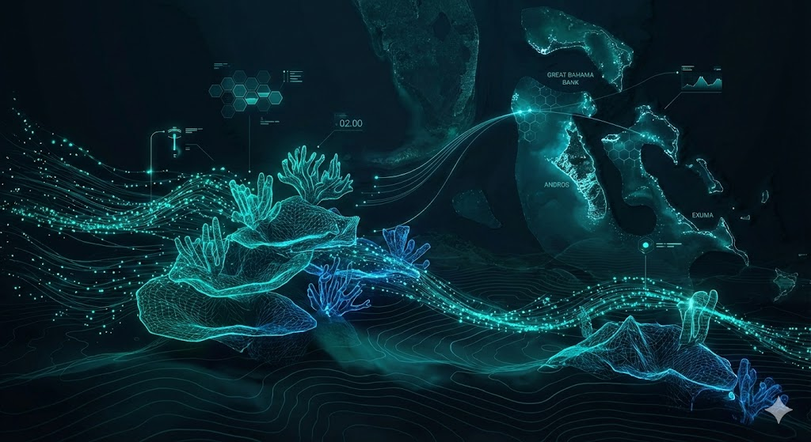
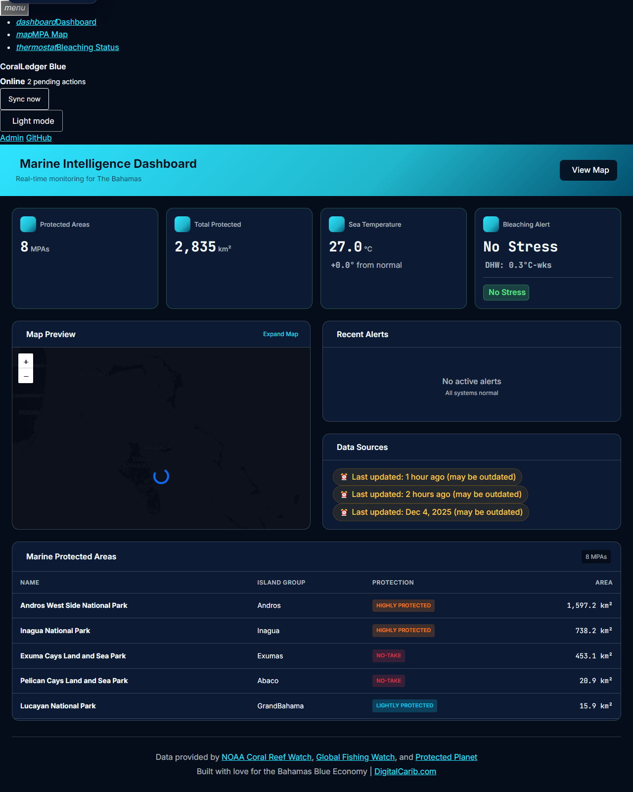
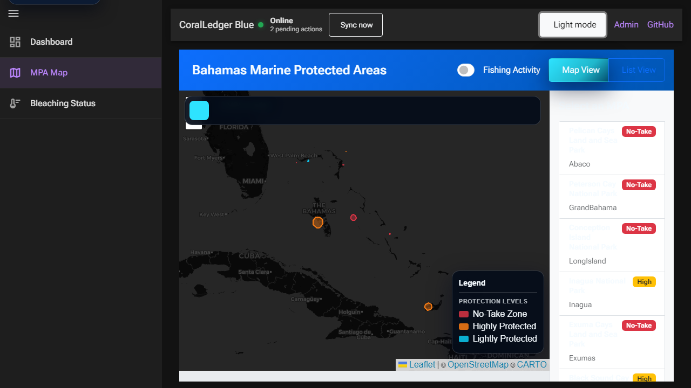
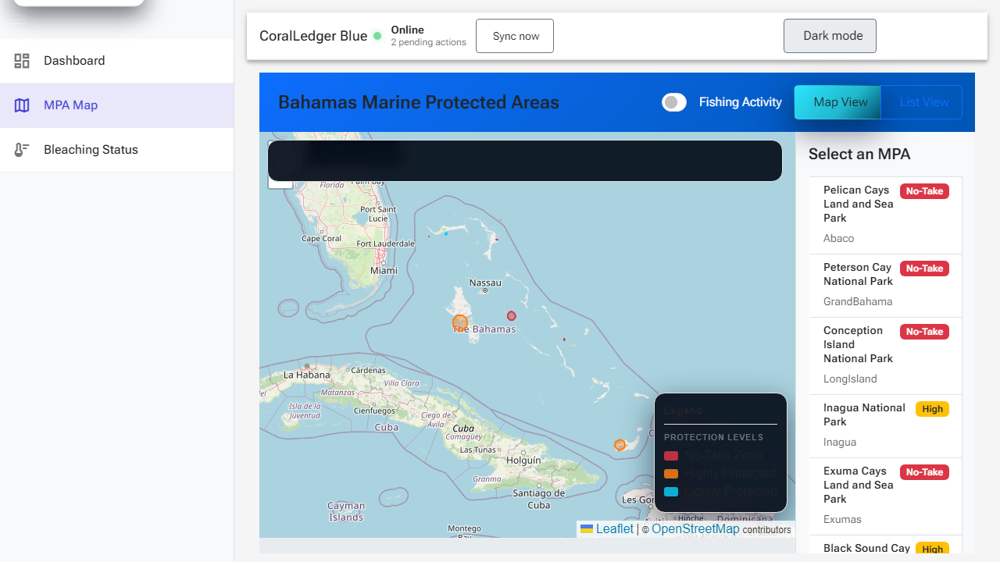

# 🐚 CoralLedger Blue



🪸 Share-ready preview: use `og-image.png` (1200×630) as the repository's `og:image`.

**Open Source Marine Intelligence for the Blue Economy**

[](https://dotnet.microsoft.com/)
[](https://blazor.net/)
[](https://postgis.net/)
[](LICENSE)
[](https://github.com/caribdigital/coralledgerblue)

> **Real-time coral bleaching monitoring. Fishing vessel tracking. 8 Marine Protected Areas. One command to run.**

CoralLedger Blue connects NOAA satellite data and Global Fishing Watch to help protect the Bahamas' 2,854 km² of ocean reserves.

Built with .NET 10, Blazor, PostGIS, and .NET Aspire—because saving reefs should be as easy as `dotnet run`.

## Quick Start

```bash
# Clone and run (requires .NET 10 SDK + Docker)
git clone https://github.com/caribdigital/coralledgerblue.git
cd coralledgerblue
dotnet run --project src/CoralLedger.Blue.AppHost
```

The Aspire dashboard opens at `https://localhost:17088` with links to the web app, pgAdmin, and PostgreSQL.

## What Can You Do With It?

- 🗺️ **Visualize all 8 Bahamas MPAs** on an interactive map with protection-level styling
- 🌡️ **Monitor coral bleaching risk** with live NOAA satellite data (SST, DHW, alerts)
- 🚢 **Track fishing vessels** and detect activity inside protected areas
- 📊 **Access everything via REST API** for your own analysis or integrations
- 🌍 **Use in your native language** - Available in English, Spanish, and Haitian Creole
- ⚡ **Run locally in 30 seconds** with .NET Aspire (PostgreSQL + PostGIS included)

## Why This Matters

The Bahamas possesses one of the world's most extensive coral reef systems—and it's under threat.

- **Climate change** is warming the ocean, causing mass coral bleaching events
- **Illegal fishing** depletes protected marine areas
- **Conservation officers** lack real-time data to respond effectively

CoralLedger Blue puts satellite data, vessel tracking, and spatial analysis into the hands of the people protecting these ecosystems. It's not just code—it's a tool for the Blue Economy.

## Help Wanted 🆘

We're actively looking for contributors in these areas:

| Area | Difficulty | What You'll Do |
|------|------------|----------------|
| 🧪 **Testing** | Medium | Help build comprehensive test coverage |
| 🌍 **Spanish Translation** | Easy | Translate UI strings for Spanish speakers |
| 🗺️ **GIS Optimization** | Advanced | Improve PostGIS query performance |
| 📝 **Documentation** | Easy | Expand guides and tutorials |
| ? **Brand & assets** | Medium | Refresh github-header.png, og-image.png, or favicons; see docs/brand-guidelines.md |

👉 **[See all Good First Issues](https://github.com/caribdigital/coralledgerblue/issues?q=is%3Aissue+is%3Aopen+label%3A%22good+first+issue%22)**

## Screenshots

### Marine Intelligence Dashboard

*The dashboard features real-time KPI cards for Protected Areas (8 MPAs), Total Protected area (2,835 km²), Sea Temperature, and Bleaching Alerts. The integrated map preview and recent alerts panel provide at-a-glance monitoring.*

### Interactive Map with Dark Theme

*The interactive map displays all 8 Bahamas MPAs with protection level styling (No-Take, Highly Protected, Lightly Protected), CartoDB Dark Matter tiles, and a dynamic legend. The sidebar lists all MPAs with their protection status badges.*

### Light Theme with MPA List

*Switch to light mode for a clean view with OpenStreetMap tiles. The MPA list shows all protected areas with quick-access badges for protection levels.*

> **Note:** To see the app in action, run `dotnet run --project src/CoralLedger.Blue.AppHost`

## Technology Stack

| Layer | Technology |
|-------|------------|
| **Runtime** | .NET 10 |
| **Frontend** | Blazor Server + WebAssembly (Auto mode) |
| **Mapping** | Leaflet.js 1.9.4 with CartoDB Dark Matter & OpenStreetMap tiles |
| **Database** | PostgreSQL 16 + PostGIS 3.4 |
| **Caching** | Redis (StackExchange.Redis) with Azure Cache support |
| **ORM** | Entity Framework Core 10 |
| **Spatial** | NetTopologySuite 2.6 |
| **CQRS** | MediatR 12.4 |
| **Jobs** | Quartz.NET 3.13 |
| **Orchestration** | .NET Aspire 13.0 |
| **Containers** | Docker |
| **Localization** | ASP.NET Core i18n (English, Spanish, Haitian Creole) |

## Visual Regression & Accessibility

### Visual regression
- Start the Aspire stack with `Scripts/coralledgerblue/Start-CoralLedgerBlueAspire.ps1 -Detached`, then run `dotnet test tests/CoralLedger.Blue.E2E.Tests/CoralLedger.Blue.E2E.Tests.csproj` to exercise the Playwright suite and capture visual baselines. The fixture now probes HTTP/HTTPS before navigating and stores failure screenshots under `tests/CoralLedger.Blue.E2E.Tests/playwright-artifacts/`.
- Store the Lighthouse/axe reports and summary screenshots near `docs/accessibility-audit.md` so regressions are traceable.

### Accessibility
- The design system tokens (`wwwroot/css/base/_variables.css`) and `docs/design-system.md` guarantee consistent focus, contrast, and typography, but the audit doc records the current gaps and remediation plan.
- Brand usage (logo, favicons, hero assets) is described in `docs/brand-guidelines.md`; re-run `scripts/create_brand_assets.py` and `scripts/create_favicons.py` whenever the palette or tagline changes so the README hero and `og:image` stay aligned.
- Protected Planet API tokens live in `docs/DEVELOPER.md` (section covering `ProtectedPlanet:ApiToken`) and `secrets.template.json`. Keep them in user secrets or environment variables rather than checked in.

## Architecture

CoralLedger Blue follows **Clean Architecture** principles with a modular monolith structure:

```
src/
├── CoralLedger.Blue.Domain/          # Entities, Value Objects, Enums
├── CoralLedger.Blue.Application/     # CQRS (MediatR), DTOs, Interfaces
├── CoralLedger.Blue.Infrastructure/  # EF Core, PostGIS, Quartz Jobs
├── CoralLedger.Blue.Web/             # Blazor Server Host + API
├── CoralLedger.Blue.Web.Client/      # Blazor WebAssembly Components
├── CoralLedger.Blue.AppHost/         # .NET Aspire Orchestrator
└── CoralLedger.Blue.ServiceDefaults/ # Shared Aspire Configuration
```

## API Endpoints

> **Public API with OAuth2 Authentication**  
> CoralLedger Blue provides a public REST API for third-party integrations. Authenticate using API keys in the `X-API-Key` header.  
> 📖 [Developer Portal Documentation](docs/API-DEVELOPER-PORTAL.md)

### API Key Management
| Endpoint | Method | Description |
|----------|--------|-------------|
| `/api/api-keys/clients` | POST | Create API client with initial key |
| `/api/api-keys/clients` | GET | List all API clients |
| `/api/api-keys/clients/{id}` | GET | Get specific API client |
| `/api/api-keys/clients/{id}/keys` | POST | Create additional API key |
| `/api/api-keys/{keyId}` | DELETE | Revoke API key |
| `/api/api-keys/clients/{id}/usage` | GET | Get usage statistics |
| `/api/api-keys/clients/{id}/logs` | GET | Get usage logs |

### Marine Protected Areas
| Endpoint | Method | Description |
|----------|--------|-------------|
| `/api/mpas` | GET | All MPAs (summary) |
| `/api/mpas/geojson` | GET | GeoJSON FeatureCollection for map |
| `/api/mpas/{id}` | GET | Single MPA details |

### Vessel Tracking (Global Fishing Watch)
| Endpoint | Method | Description |
|----------|--------|-------------|
| `/api/vessels/search` | GET | Search vessels by name, flag, type |
| `/api/vessels/{vesselId}` | GET | Get vessel details |
| `/api/vessels/fishing-events` | GET | Fishing events in a region |
| `/api/vessels/fishing-events/bahamas` | GET | Fishing events in Bahamas |
| `/api/vessels/encounters` | GET | Vessel encounters at sea |
| `/api/vessels/stats` | GET | Fishing effort statistics |

### Coral Bleaching (NOAA Coral Reef Watch)
| Endpoint | Method | Description |
|----------|--------|-------------|
| `/api/bleaching/point` | GET | Bleaching data for a location |
| `/api/bleaching/region` | GET | Bleaching data for a region |
| `/api/bleaching/bahamas` | GET | Current Bahamas bleaching alerts |
| `/api/bleaching/timeseries` | GET | DHW time series for a location |
| `/api/bleaching/mpa/{mpaId}` | GET | Bleaching data for an MPA |

### Background Jobs
| Endpoint | Method | Description |
|----------|--------|-------------|
| `/api/jobs/status` | GET | All job statuses and sync info |
| `/api/jobs/sync/bleaching` | POST | Trigger manual bleaching sync |
| `/api/jobs/sync/vessels` | POST | Trigger manual vessel event sync |

## Database Schema

### Marine Protected Areas
- Spatial boundaries (PostGIS Geometry)
- Protection levels (NoTake, HighlyProtected, LightlyProtected)
- Island group classification
- WDPA (World Database on Protected Areas) integration

### Vessels
- Vessel identity (MMSI, IMO, Call Sign)
- Global Fishing Watch integration
- Vessel type and gear classification
- Flag state tracking

### Vessel Positions & Events
- AIS position tracking with spatial indexing
- Fishing events, encounters, port visits
- MPA intersection detection
- Distance from shore calculation

### Bleaching Alerts
- NOAA Coral Reef Watch metrics
- Sea Surface Temperature (SST)
- Degree Heating Week (DHW)
- Alert levels (Watch, Warning, Alert 1-5)

### Reefs
- Location geometry
- Health status tracking
- Coral cover and bleaching metrics
- Survey history

## Seeded Data

The application comes pre-seeded with 8 Bahamas Marine Protected Areas:

| MPA | Island Group | Protection Level | Area (km²) |
|-----|--------------|------------------|------------|
| Exuma Cays Land and Sea Park | Exumas | No-Take | 456.0 |
| Andros West Side National Park | Andros | Highly Protected | 1,607.5 |
| Inagua National Park | Inagua | Highly Protected | 743.0 |
| Pelican Cays Land and Sea Park | Abaco | No-Take | 21.0 |
| Lucayan National Park | Grand Bahama | Lightly Protected | 16.0 |
| Conception Island National Park | Long Island | No-Take | 8.5 |
| Black Sound Cay National Reserve | Abaco | Highly Protected | 1.2 |
| Peterson Cay National Park | Grand Bahama | No-Take | 0.6 |

## Project Roadmap

### Phase 1: Spatial Foundation ✅
- [x] Clean Architecture setup
- [x] PostGIS spatial database
- [x] MPA entity with spatial boundaries
- [x] Bahamas MPA seed data
- [x] Blazor web interface
- [x] .NET Aspire orchestration

### Phase 2: Interactive Map ✅
- [x] Leaflet.js map component with OpenStreetMap
- [x] MPA polygon rendering with protection level styling
- [x] GeoJSON API endpoints
- [x] Blazor WebAssembly integration
- [x] Map/List view toggle
- [x] Click-to-select MPA on map
- [x] Zoom-to-MPA on selection
- [x] Selection highlight with info popup

### Phase 3: Data Ingestion ✅
- [x] Global Fishing Watch API v3 integration
- [x] NOAA Coral Reef Watch ERDDAP integration
- [x] Vessel tracking domain entities
- [x] Bleaching alert domain entities
- [x] REST API endpoints for external data
- [x] Protected Planet WDPA API integration
- [x] Automated data pipelines (Quartz.NET)
- [ ] Vessel activity visualization on map

### Phase 4: Citizen Science
- [ ] PWA offline support
- [ ] Photo upload with AI species identification
- [ ] Invasive species reporting (Lionfish tracking)
- [ ] Community observations

### Phase 5: AI Intelligence
- [ ] Semantic Kernel integration
- [ ] Natural language queries ("Show reefs with high bleaching risk")
- [ ] Text-to-SQL for spatial queries
- [ ] Predictive analytics

## Configuration

> **IMPORTANT**: Never store API keys or secrets in `appsettings.json` or commit them to version control.

### Local Development (User Secrets)

For vessel tracking features, obtain a free API key from [Global Fishing Watch](https://globalfishingwatch.org/our-apis/tokens).

```bash
# Initialize user secrets (one-time)
dotnet user-secrets init --project src/CoralLedger.Blue.Web

# Set Global Fishing Watch API token
dotnet user-secrets set "GlobalFishingWatch:ApiToken" "your-token-here" --project src/CoralLedger.Blue.Web
dotnet user-secrets set "GlobalFishingWatch:Enabled" "true" --project src/CoralLedger.Blue.Web
```

NOAA Coral Reef Watch data is publicly available and requires no authentication.

### Redis Cache (Local Development)

The application uses Redis for distributed caching. To run Redis locally:

```bash
# Using Docker (recommended)
docker run -d -p 6379:6379 --name coralledger-redis redis:7-alpine
```

The application will automatically connect to `localhost:6379`. See [Redis Setup Guide](docs/REDIS.md) for detailed configuration options, Azure Cache for Redis setup, and troubleshooting.

### Production Deployment

For production, use one of these secure options:
- **Azure Key Vault** (recommended for Azure deployments)
- **Environment Variables**
- **Docker Secrets** (for containerized deployments)

See [.NET Secret Management](https://learn.microsoft.com/en-us/aspnet/core/security/app-secrets) for details.

## Documentation

- [Architecture Overview](docs/architecture.md)
- [Redis Caching Guide](docs/REDIS.md) - Distributed caching setup and configuration
- [Phase 1 Delivery](docs/phase1-delivery.md)
- [Phase 2 Delivery](docs/phase2-delivery.md)
- [Accessibility audit plan](docs/accessibility-audit.md)
- [Brand guidelines](docs/brand-guidelines.md)
- [Contributing Guide](docs/CONTRIBUTING.md)

## Community

- 💬 **Discussions** — [GitHub Discussions](https://github.com/caribdigital/coralledgerblue/discussions)
- 🐛 **Issues** — [Report bugs or request features](https://github.com/caribdigital/coralledgerblue/issues)
- 📧 **Contact** — [DigitalCarib.com](https://digitalcarib.com)

## Contributing

We welcome contributions! Please see [CONTRIBUTING.md](docs/CONTRIBUTING.md) for guidelines.

## License

This project is licensed under the MIT License - see the [LICENSE](LICENSE) file for details.

---

If CoralLedger Blue helps you or inspires you, consider giving it a ⭐ — it helps others discover the project!

---

## Acknowledgments

- **Bahamas National Trust** - MPA data and conservation efforts
- **Protected Planet / WDPA** - Global protected areas database
- **Allen Coral Atlas** - Coral reef mapping data
- **.NET Team** - Aspire, Blazor, and EF Core
- **Leaflet.js** - Open source JavaScript map library

---

**Created by Robbie McKenzie - Founder, [DigitalCarib.com](https://digitalcarib.com)**

**Built with love for the Bahamian Blue Economy** 🇧🇸
