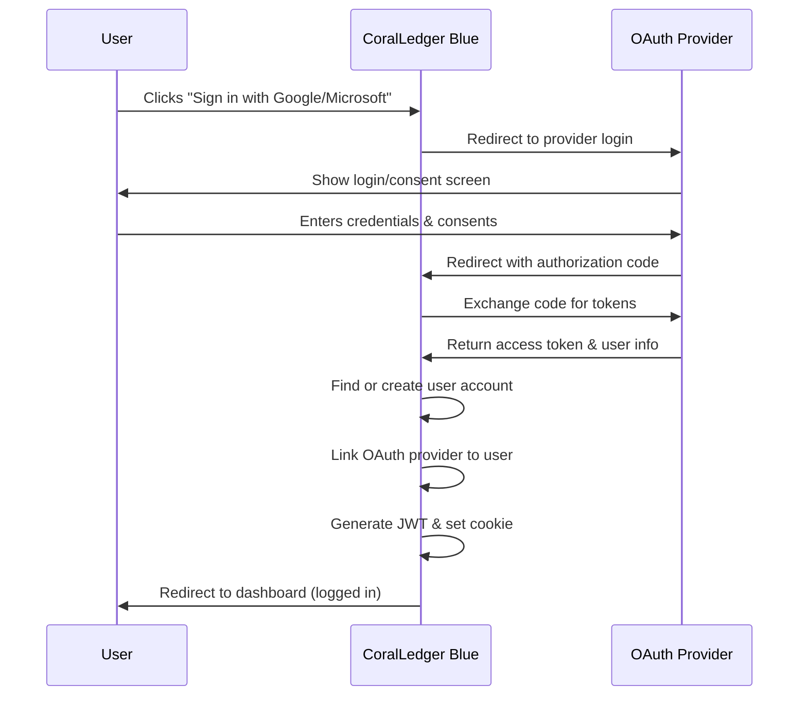

# OAuth2 External Provider Configuration Guide

This guide explains how to configure Google and Microsoft OAuth2 authentication for CoralLedger Blue users.

## Overview

CoralLedger Blue supports OAuth2 authentication with external providers, allowing users to sign in with their existing Google or Microsoft accounts. This provides:

- **Easier onboarding** - No need to create and remember another password
- **Improved security** - Leverage Google/Microsoft's security features (2FA, account recovery, etc.)
- **Verified emails** - Email addresses are automatically confirmed by the OAuth provider

## Features

✅ **Google Sign-In** - Users can authenticate with their Google accounts  
✅ **Microsoft Sign-In** - Users can authenticate with their Microsoft accounts  
✅ **Account Linking** - OAuth accounts automatically link to existing users by email  
✅ **New User Creation** - First-time OAuth users get accounts created automatically  
✅ **Email Verification** - OAuth users have pre-verified email addresses  
✅ **Hybrid Authentication** - Users can have both password and OAuth authentication  

## Prerequisites

### For Google OAuth

1. A Google Cloud Platform account
2. Access to [Google Cloud Console](https://console.cloud.google.com/)
3. A project created in Google Cloud Console

### For Microsoft OAuth

1. An Azure account (or Microsoft 365 developer account)
2. Access to [Azure Portal](https://portal.azure.com/)
3. An Azure AD app registration

## Configuration Steps

### Step 1: Create OAuth Applications

#### Google Cloud Console Setup

1. **Navigate to Google Cloud Console**
   - Go to https://console.cloud.google.com/
   - Select or create a project

2. **Enable Google+ API** (if not already enabled)
   - Go to "APIs & Services" > "Library"
   - Search for "Google+ API"
   - Click "Enable"

3. **Configure OAuth Consent Screen**
   - Go to "APIs & Services" > "OAuth consent screen"
   - Choose "External" user type
   - Fill in application details:
     - App name: "CoralLedger Blue"
     - User support email: Your support email
     - Developer contact: Your development team email
   - Add scopes: `email`, `profile`, `openid`
   - Add test users (if in testing mode)
   - Save and continue

4. **Create OAuth 2.0 Credentials**
   - Go to "APIs & Services" > "Credentials"
   - Click "Create Credentials" > "OAuth client ID"
   - Application type: "Web application"
   - Name: "CoralLedger Blue Web"
   - Authorized redirect URIs:
     - Development: `https://localhost:5001/api/auth/signin-google`
     - Production: `https://yourdomain.com/api/auth/signin-google`
   - Click "Create"
   - **Copy the Client ID and Client Secret** (you'll need these)

#### Azure AD App Registration Setup

1. **Navigate to Azure Portal**
   - Go to https://portal.azure.com/
   - Navigate to "Azure Active Directory"

2. **Register an Application**
   - Click "App registrations" > "New registration"
   - Name: "CoralLedger Blue"
   - Supported account types: 
     - Choose "Accounts in any organizational directory and personal Microsoft accounts"
   - Redirect URI:
     - Platform: Web
     - Development: `https://localhost:5001/api/auth/signin-microsoft`
     - Production: `https://yourdomain.com/api/auth/signin-microsoft`
   - Click "Register"

3. **Create Client Secret**
   - In your app registration, go to "Certificates & secrets"
   - Click "New client secret"
   - Description: "CoralLedger Blue Web Secret"
   - Expires: Choose appropriate expiration (12 months recommended)
   - Click "Add"
   - **Copy the secret value immediately** (shown only once)

4. **Note Application (client) ID**
   - Go to "Overview" tab
   - **Copy the Application (client) ID**

### Step 2: Configure CoralLedger Blue

#### Development (User Secrets)

For local development, use .NET User Secrets to store credentials securely:

```bash
# Navigate to the Web project
cd src/CoralLedger.Blue.Web

# Set Google credentials
dotnet user-secrets set "Authentication:Google:ClientId" "your-google-client-id"
dotnet user-secrets set "Authentication:Google:ClientSecret" "your-google-client-secret"

# Set Microsoft credentials
dotnet user-secrets set "Authentication:Microsoft:ClientId" "your-microsoft-client-id"
dotnet user-secrets set "Authentication:Microsoft:ClientSecret" "your-microsoft-client-secret"
```

#### Production (Environment Variables)

For production deployments, use environment variables:

```bash
# Docker / Kubernetes
Authentication__Google__ClientId=your-google-client-id
Authentication__Google__ClientSecret=your-google-client-secret
Authentication__Microsoft__ClientId=your-microsoft-client-id
Authentication__Microsoft__ClientSecret=your-microsoft-client-secret

# Azure App Service
AUTHENTICATION__GOOGLE__CLIENTID=your-google-client-id
AUTHENTICATION__GOOGLE__CLIENTSECRET=your-google-client-secret
AUTHENTICATION__MICROSOFT__CLIENTID=your-microsoft-client-id
AUTHENTICATION__MICROSOFT__CLIENTSECRET=your-microsoft-client-secret
```

#### Alternative: appsettings.json (Not Recommended for Production)

**⚠️ Warning**: Only use this for development. Never commit secrets to source control.

```json
{
  "Authentication": {
    "Google": {
      "ClientId": "your-google-client-id.apps.googleusercontent.com",
      "ClientSecret": "your-google-client-secret"
    },
    "Microsoft": {
      "ClientId": "your-microsoft-app-id",
      "ClientSecret": "your-microsoft-client-secret"
    }
  }
}
```

### Step 3: Verify Configuration

1. **Start the application**:
   ```bash
   dotnet run --project src/CoralLedger.Blue.Web
   ```

2. **Navigate to the login page**:
   - Open https://localhost:5001/login
   - You should see "Continue with Google" and "Continue with Microsoft" buttons

3. **Test OAuth flow**:
   - Click one of the OAuth buttons
   - You should be redirected to the provider's login page
   - After successful authentication, you should be redirected back and logged in

## How It Works

### Authentication Flow



### Account Linking

When a user signs in with OAuth:

1. **Existing User**: If a user with the same email already exists:
   - The OAuth provider information is added to their account
   - They can now use both password and OAuth to sign in
   - Email is automatically marked as verified

2. **New User**: If no user exists with that email:
   - A new account is created automatically
   - Email is pre-verified (no verification email needed)
   - User is assigned to the default tenant
   - No password is set (OAuth-only authentication)

## Security Considerations

### OAuth Provider Selection

- Only register with **trusted OAuth providers** (Google, Microsoft)
- Keep Client IDs and Secrets secure
- Rotate secrets regularly (recommended: every 6-12 months)
- Use different credentials for development and production

### Redirect URI Security

- **Always use HTTPS** in production
- Exact match required - trailing slashes matter
- Whitelist only necessary redirect URIs
- Never use wildcards in redirect URIs

### User Privacy

- Request only necessary scopes (email, profile, openid)
- Respect user consent choices
- Provide clear privacy policy
- Allow users to unlink OAuth accounts (future feature)

## Troubleshooting

### "OAuth provider not configured" Error

**Problem**: OAuth buttons don't work or return errors.

**Solution**: 
1. Verify credentials are set correctly:
   ```bash
   dotnet user-secrets list --project src/CoralLedger.Blue.Web
   ```
2. Ensure credentials are not empty or "not-configured"
3. Check application logs for configuration errors

### "Redirect URI Mismatch" Error

**Problem**: OAuth provider shows "redirect_uri_mismatch" error.

**Solution**:
1. Verify the redirect URI in your OAuth app matches exactly:
   - Google: `https://yourdomain.com/api/auth/signin-google`
   - Microsoft: `https://yourdomain.com/api/auth/signin-microsoft`
2. Check for trailing slashes (must match exactly)
3. Ensure protocol matches (http vs https)
4. For localhost testing, use `https://localhost:5001/` not `http://localhost:5000/`

### "Invalid Client" Error

**Problem**: OAuth provider rejects the client ID or secret.

**Solution**:
1. Verify credentials are copied correctly (no extra spaces)
2. Check if secret has expired (Microsoft secrets expire)
3. Ensure API is enabled (Google requires Google+ API)
4. Verify app registration is active (not deleted)

### Users Can't Sign In After OAuth Setup

**Problem**: OAuth login creates new account instead of linking to existing.

**Solution**:
- OAuth links accounts by email address
- Ensure the email in the existing account matches the OAuth provider email
- Email addresses are case-insensitive in the system

## Testing

### Test Users (Development)

For Google:
- Add test users in OAuth consent screen (when in testing mode)
- Only test users can sign in until app is verified

For Microsoft:
- Test with any Microsoft account (personal or work/school)
- No special configuration needed for testing

### Integration Tests

Run OAuth-related tests:
```bash
dotnet test tests/CoralLedger.Blue.IntegrationTests/CoralLedger.Blue.IntegrationTests.csproj \
  --filter "FullyQualifiedName~OAuthAuthenticationEndpointsTests"
```

## Production Deployment

### Pre-deployment Checklist

- [ ] OAuth apps created for production domain
- [ ] Redirect URIs updated to production URLs
- [ ] Client IDs and secrets stored securely (Key Vault, environment variables)
- [ ] Secrets not committed to source control
- [ ] OAuth consent screens approved by providers (if required)
- [ ] Privacy policy and terms of service linked
- [ ] HTTPS enabled and enforced
- [ ] Monitoring and logging configured
- [ ] Tested with real user accounts

### Monitoring

Monitor these metrics:
- OAuth success/failure rates
- New vs existing user OAuth logins
- Provider-specific authentication failures
- Account linking operations

Check logs for:
- `OAuth callback error for provider` - indicates OAuth flow failures
- Failed authentication attempts
- Unexpected redirects or errors

## Support

### Google OAuth Support
- Documentation: https://developers.google.com/identity/protocols/oauth2
- Console: https://console.cloud.google.com/

### Microsoft OAuth Support  
- Documentation: https://docs.microsoft.com/azure/active-directory/develop/
- Portal: https://portal.azure.com/

### CoralLedger Blue Issues
- For application-specific issues, check the GitHub repository issues
- Review application logs in `logs/` directory
- Enable debug logging: Set `Logging:LogLevel:Default` to `Debug` in appsettings

## Future Enhancements

Planned features (not yet implemented):
- OAuth account unlinking from user profile
- GitHub OAuth provider (for developer users)
- Azure AD organization-specific authentication
- Multi-factor authentication (MFA) with OAuth providers
- OAuth account management UI in user profile
